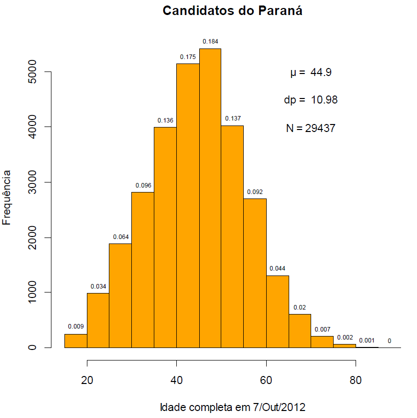

```{r setup, include=FALSE}
knitr::opts_chunk$set(echo = TRUE)
```

## Curva Normal Padrão

```{r, echo = FALSE}
# Curva
rm(list = ls(all = TRUE))

# funcao para plotagem da normal
normalplot <- function(media = 0, dp = 1, z1 = 0, z2 = NULL, verz = FALSE, cor = "skyblue"){

  if(media == 0 & dp == 1){ 
    eixo = "z"
  } else eixo = "x"
  
  lim <- c(media-round(3.5*dp,2),media+round(3.5*dp,2))
  x <- seq(lim[1], lim[2], by = 0.01)
  
  cn1 <- function(x) {dnorm(x,media,dp)} # curva normal
  
  y= cn1(x)
  
  plot(x, y, ylab="Densidade", xlab=eixo, type="l",lwd=2)
  
  # distribuicao
  if(is.null(z2)){
    xaux <- seq(lim[1], z1, by = 0.01)
    polygon(c(min(xaux), xaux, max(xaux)), c(0, cn1(xaux),0), col=cor, border=cor)
  } else {
    if(z2 < z1){
      z <- z2; z2 <- z1; z1 <- z
    }
    xaux <- seq(z1, z2, by = 0.01)
    polygon(c(min(xaux), xaux, max(xaux)), c(0, cn1(xaux),0), col=cor, border=cor)
  }

  # reforca as curvas
  lines(c(lim[1],lim[2]),c(0,0))
  lines(x, cn1(x),lwd=2, type="l")
  lines(c(media,media), c(0,cn1(media)), lty = 2)
  lines(c(z1, z1),c(-1, cn1(z1)))

  if(verz){
    text(z1, 0.02, pos = 4, paste0(eixo, " = ", z1))  
  } else text(z1, 0.02, pos = 4, eixo)

  if(!is.null(z2)){
    lines(c(z2, z2),c(-1, cn1(z2)))
  
    if(verz){
      text(z2, 0.01, pos = 4, paste0(eixo, " = ", z2))  
    } else text(z2, 0.01, pos = 4,eixo)
  }
}


# plota normal
z <- 0.4; media <- 0; dp <- 1
normalplot(media, dp, z)

# tabela de probabilidades
ini <- 0
fim <- 3.09

z <- seq(ini,fim,0.01)
p <- pnorm(z)
m <- round(matrix(p, ncol=10, byrow=TRUE),4)
z2 <- round(seq(ini,fim,0.1),1)
col <- seq(0.0,0.09,0.01)

df <- cbind(z2,m)
colnames(df) <- c("z",col)

knitr::kable(df, caption = "Curva Normal Padrao - Tabela de Probabilidades P(Z <= z)")

```

## Questões

### 1) Suponha que ***X*** é normal com média igual a **8** e desvio-padrão igual a **5**. Encontre **P(*X* <= 8,6)**.

```{r, echo=FALSE}

z = (8.6 - 8)/5
sprintf('Valor de z = (8.6-8)/5 = %f', z)
print('Para z = 0.12 a tabela fornece 0.5478')
sprintf('Cálculo usando a função pnorm: %f', pnorm(z))
```


### 2) Suponha que ***X*** é normal com média igual a **10** e desvio-padrão igual a **3**. Encontre **P(*X* > 8,6)**.

```{r, echo=FALSE}

z = (8.6 - 10)/3
sprintf('Valor de z = (8.6-10)/3 = %f', z)
print('Não temos valor da tabela para números negativos. Mas como é simétrica, a P(X <= -a) = P(x > a) para a positivo.' )
print('Para z = 0.4666 a tabela fornece próximo a 0.6808')
sprintf('Cálculo usando a função pnorm: %f', 1-pnorm(z))

```


### 3) Suponha que ***X*** é normal com média igual a **10** e desvio-padrão igual a **6**. Encontre **P(7,3 < *X* <= 12,4)**.

```{r, echo=FALSE}
z1 = (7.3 - 10)/6
z2 = (12.4 - 10)/6

print('Para esse exercício podemos normalizar em dois pontos, z1 = (7.3 - 10)/6 e z2 = (12.4 - 10)/6')
sprintf('z1 = %f, z2 = %f', z1, z2)
sprintf('Para z = -0.45 a tabela fornece 1 - 0.6736 = %f', 1 - 0.6736)
sprintf('Para z = 0.4 a tabela fornece 0.6554')
sprintf('A resposta é a subtração das duas coisas: %f', 0.6554 -  (1 - 0.6736))
sprintf('Cálculo usando a função pnorm: %f', pnorm(z2) - pnorm(z1))

```

### 4) Suponha que ***X*** é normal com média igual a **0** e desvio-padrão igual a **1**. Encontre **P(-1,96 < *X* <= 1,96)**.

Na tabela o valor de 1.96 corresponde a 0.9750. Isso significa que a área a direita de 1.96 e a esquerda de -1.96 é de (1 - 0.9750) = 0.025').

Dessa forma, a valor entre -1.96 e +1.96 é 0.95.

```{r, echo=FALSE}
sprintf('Cálculo usando a função pnorm: %f', pnorm(1.96) - pnorm(-1.96))
```

### 5) Suponha que ***X*** é normal com média igual a **44.90** e desvio-padrão igual a **10.98**. Encontre **P(20 < *X* <= 40)**.


```{r, echo=FALSE}

z1 = (20 - 44.9)/10.98
z2 = (40 - 44.9)/10.98
sprintf('Convertendo 20 e 40 para o score padrão, temos %f e %f', z1, z2)
print('A tabela não tem número negativo, mas pela simetria a área entre -2.2677 e 0.4462 é igual a área entre 0.4462 e 2.2677')
sprintf('Pela tabela: %f - %f = %f', 0.9884, 0.6736, 0.9884-0.6736)
sprintf('Cálculo usando a função pnorm: %f', pnorm(z2) - pnorm(z1))

```


### 6) Suponha que ***X*** é normal com média igual a **44.90** e desvio-padrão igual a **10.98**. Encontre **P(*X* > 60)**.

```{r, echo=FALSE}

z = (60 - 44.9)/10.98

sprintf('Convertendo 60 para o equivalente na normal padrão: %f', z)
print('O valor para esse z na tabela equivale a 0.9147')
sprintf('Como estamos interessados no lado direito da curva, temos que calcular 1 - 0.9147 = %f', 1 - 0.9147)

sprintf('Cálculo usando a função pnorm: %f', 1 - pnorm(z))

```


### 7) Repita as questões 5 e 6 tomando por base o histograma a seguir:




```{r, echo=FALSE}

sprintf('Idade entre 20 e 40: %f', (0.034 + 0.064 + 0.096 + 0.136))
sprintf('Idade acima de 60: %f', (0.044 + 0.02 + 0.007 + 0.002 + 0.001))

```

### 8) O que pode ser dito sobre os resultados encontrados nas questões 5, 6 e 7?

Embora os resultados das questões 5 e 6 não sejam iguais a da questão 7, eles são semelhantes. Para esse conjunto de dados, nesse intervalo, a distribuição pode ser aproximada por uma distribuição normal com média 44,9 e desvio padrão 10,98. 

### 9) Suponha que ***X*** é normal com média igual a **500** e desvio-padrão igual a **40**. Encontre o valor aproximado de **P(*X* > 550)**.


```{r, echo=FALSE}

z = (550 - 500)/40

sprintf('Convertendo 550 para o equivalente na normal padrão: %f', z)
print('O valor para esse z na tabela equivale a 0.8944')
sprintf('Como estamos interessados no lado direito da curva, temos que calcular 1 - 0.8944 = %f', 1 - 0.8944)

sprintf('Cálculo usando a função pnorm: %f', 1 - pnorm(z))

```

```{r, echo=FALSE, warning=FALSE}
# histograma acumulado
set.seed(6745389)
X <- rnorm(10000, 500, 40)
h <- hist(X,freq = TRUE,plot=FALSE)
h.cum <- cumsum(h$counts/length(X))
x <- h$breaks[-1]
plot(x, h.cum, pch=16, main="Função de Distribuição Acumulada",
     xlab="X", ylab="Probabilidade")
lines(x, h.cum)


```

### 10) Usando a Função de Distribuição Acumulada da questão anterior encontre o valor aporximado de **P(450 < *X* <= 550)**.

No exercício anterior calculamos que P(X > 550) = 0.1056. Como a distribuição tem média 550 e estamos interessados no intervalo entre 450 e 550, sabemos que P(X <= 450) = P(X > 550) = 0.1056.

Dessa forma, P(450 < X <= 550) = 1 - 2*0.1056 = 0.788

```{r, echo=FALSE}
z1 = (450 - 500)/40
z2 = (550 - 500)/40
sprintf('Cálculo usando a função pnorm: %f', pnorm(z2) - pnorm(z1))

```
